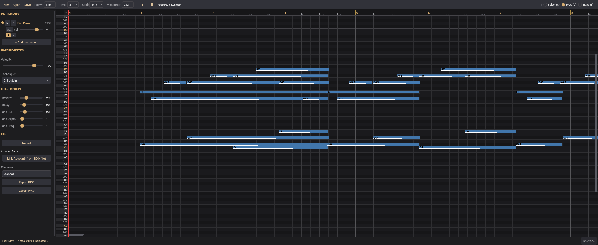

# BDO Music Compositor

Compose music for Black Desert Online outside of the game. Import MIDIs, edit in a full piano roll, tweak instruments and effects, then export directly to BDO's in-game format.

Supports all 26+ BDO instruments, per-instrument aux sends, MIDI tempo maps, and automatic sample extraction from your game installation so no copyrighted assets are distributed.



**Early access** — there will be bugs. Report them via [Issues](https://github.com/Bishop-R/BDOMusicTool/issues) or Discord DM: `bishof.`

Most inputs are handled via shortcuts. Check the shortcut window in the bottom right if you're lost.

## Download

Grab the latest build from [Releases](https://github.com/Bishop-R/BDOMusicTool/releases). Extract and run `composer.exe`. The first launch walks you through sample extraction and account setup.

## Build from Source

Needs CMake 3.20+ and a C compiler. SDL3 is fetched automatically.

```bash
cd src && mkdir build && cd build
cmake .. && make
./composer
```

Windows cross-compile from Linux:
```bash
cmake .. -DCMAKE_TOOLCHAIN_FILE=../mingw-toolchain.cmake && make
```

Linux desktop integration (icon + .desktop file):
```bash
./install-linux.sh
```

## What it Does

- Piano roll editor
- MIDI import with automatic tempo change handling and instrument mapping
- BDO export
- WAV export
- All BDO instruments: Beginner, Florchestra, Marnian synths, electric guitars
- Per-instrument reverb, delay, and chorus sends (Still WIP)
- Undo/redo, copy/paste, transpose, etc.
- Extracts instrument samples from your BDO installation on first launch

## Disclaimer

This tool reads data from your local BDO installation to extract instrument samples. It does not modify any game files or connect to game servers. Not affiliated with Pearl Abyss.

## License

GPL-3.0
